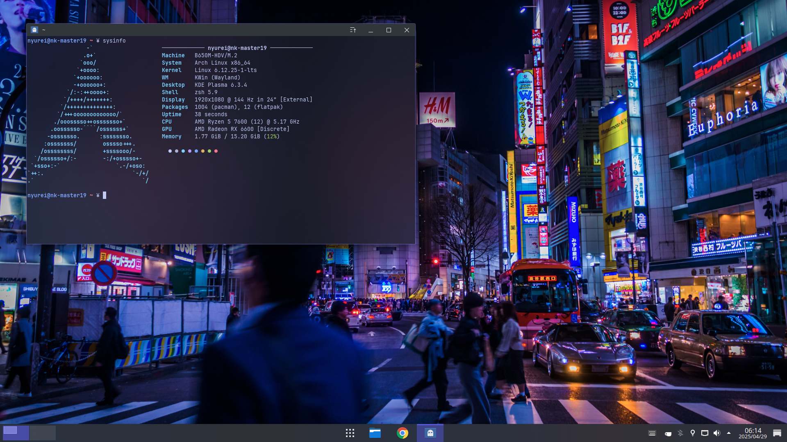
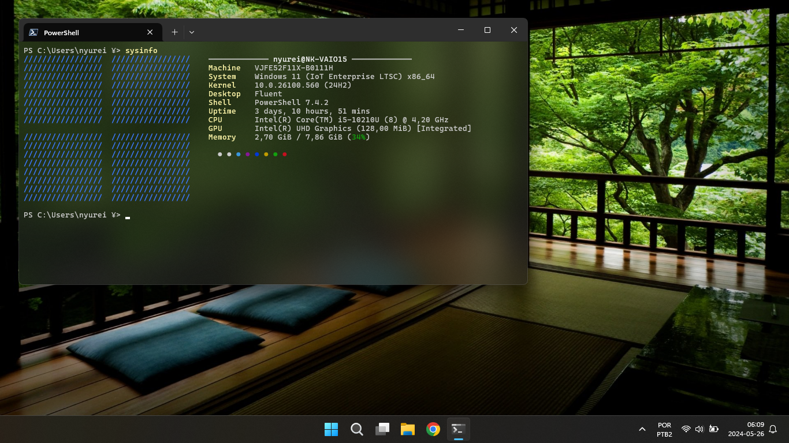

# dotfiles

My configuration files and scripts for Windows and Linux.

### Targets

- aria2
- fastfetch
- fontconfig
- git
- ghostty
- mpv
- nvim
- pwsh (PowerShell 7+)
- tmux
- vscode (Visual Studio Code)
- zsh
- wt (Windows Terminal)

### Quick setup

#### Linux

```
$ ./install.sh
```

__OBS:__ If you want to just copy the config files instead of making links, run it with the `-c` argument.

```
$ ./install.sh -c
```

#### Windows

```
> ./install.ps1
```

*This script only suports PowerShell version 7 or above.

If you want to disable the configuration of a specific target, simply comment out the function call at the end of the install script.

```sh
...
setup_aria2
setup_fontconfig
setup_git
#setup_mpv
setup_nvim
setup_zsh
#setup_mpv_scripts
#setup_nvim_theme
```

### Screenshots





### License

This project is licensed under the __BSD Zero Clause License__ - See the [LICENSE](./LICENSE) file for more details.
