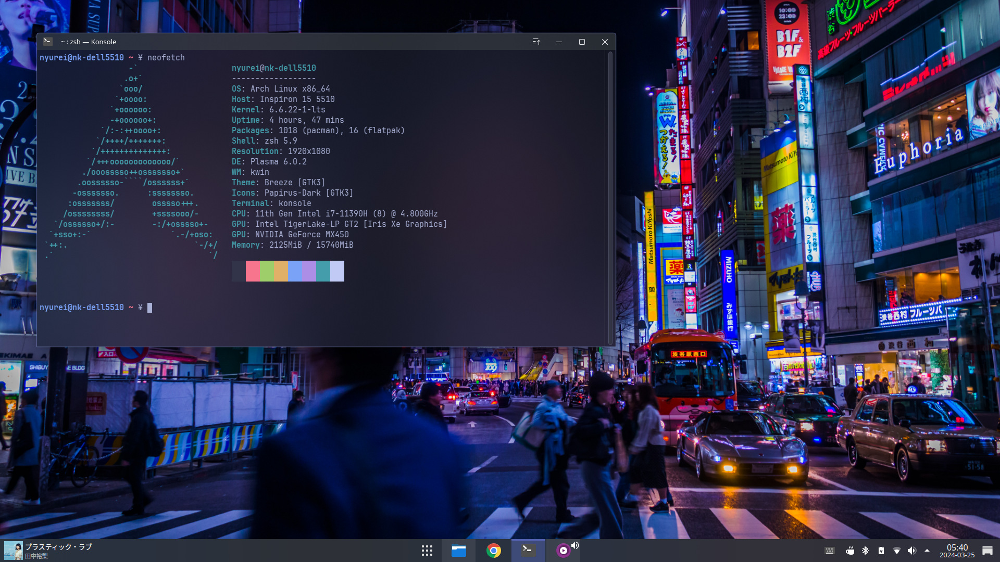

# dotfiles

My configuration files and scripts for Windows and Linux.



[](https://kernel.org)
[](https://www.microsoft.com/windows)
[](./LICENSE)

### Targets

- aria2
- fontconfig
- git
- mpv
- nvim
- pwsh (PowerShell)
- vim
- vscode (Visual Studio Code)
- zsh

### Quick setup

#### Linux

> [!NOTE]
> For now, there is only a Linux version of the quick install script.

```
$ ./install.sh
```

If you want to disable the configuration of a specific target, simply comment out the function call at the end of the install script.

```sh
...
setup_aria2
setup_fontconfig
setup_git
#setup_mpv
setup_nvim
setup_zsh
#setup_mpv_scripts
#setup_nvim_theme
```

### License

This project is licensed under the __BSD Zero Clause License__ - See the [LICENSE](./LICENSE) file for more details.
